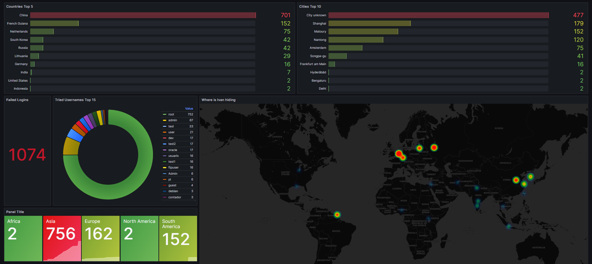

[](https://github.com/whosFritz/geo-mapping-ivan/actions/workflows/go.yml)

# GEO MAPPING IVAN :bearded_person: :world_map: :mag_right:


## Log Data Collection and Visualization :bar_chart:

This project aims to collect log data from the `/var/log/auth.log` file, extract IP addresses and usernames from failed login attempts, and use API calls to get geographical data such as longitude, latitude, city, country, and more. The collected data is then saved into MariaDB and can be visualized using Grafana.
Old version collected to prometheus but I changed it to MariaDB because there were some bugs I couldn't fix :sweat_smile:
Old version still avaiable in the [here](old_prometheus_way_code.go.txt).

## Grafana Dashboard to use it urself :prince:

- [Geo-Mapping-Ivan on Grafana Labs](https://grafana.com/grafana/dashboards/19450-geo-mapping-ivan/)
- I will try to regulary update the json file on grafana labs and here in the src code :grin:

### Showcase



## Prerequisites :gear:

- Go (Golang) programming language
- MariaDB or MySQL database
- Grafana
- `github.com/fsnotify/fsnotify` library
- `github.com/fsnotify/fsnotify` library
- `github.com/go-sql-driver/mysql` library
- `github.com/ipdata/go` library
- `github.com/joho/godotenv` library

## Contribute :construction_worker_man: :construction_worker_man:

Contributions are welcome! If you'd like to contribute to this project, follow these steps:

1. Fork this repository.
2. Create a new branch: `git checkout -b feature/new-feature`
3. Make your changes and commit them: `git commit -m 'Add some feature'`
4. Push to the branch: `git push origin feature/new-feature`
5. Submit a pull request.

Found a bug? Have a suggestion? [Open an issue](https://github.com/whosFritz/geo-mapping-ivan/issues).

Your contributions are greatly appreciated! :rocket:

## Setup :wrench:

1. Clone the repository to your local machine:

   ```bash
   git clone https://github.com/whosFritz/geo-mapping-ivan.git
   cd geo-mapping-ivan
   ```

2. Install the required Go libraries:
   ```bash
   go get github.com/fsnotify/fsnotify
   go get github.com/go-sql-driver/mysql
   go get github.com/ipdata/go
   ```
3. Create a .env file in the project directory (recommended if u contribute to this project) and add your API token :key:

   - you can get an api token from [here](https://ipdata.co/)
   - TOKEN=your_api_token_here
   - make sure the filepaths are correct
   - if you're contributing to the project also see their [docs](https://docs.ipdata.co/docs) :bookmark_tabs:

4. Build the project:

   ```bash
   go build
   ```

## Usage :computer:

**Only for the PROMETHEUS SOLUTION**

1. Edit your prometheus.yml

   ```bash
   // ... other configs ...

   - job_name: 'geo-mapping-ivan'
    metrics_path: '/metrics'
    scrape_interval: 10s
    static_configs:
    - targets: ['localhost:9101']

   // ... other configs ...
   ```

2. Start Prometheus
   - Prometheus will start and collect metrics exposed by the application.
3. Start the application:

   ```bash
   ./geo-mapping-van
   ```

   The application will monitor changes to the /var/log/auth.log file and extract data from failed login attempts. It will then record the data as Prometheus metrics. :timer_clock:

4. Start Grafana and set up Prometheus as a data source.

5. Import the provided Grafana dashboard to visualize the recorded metrics. :white_check_mark:

## Creating a System Service File :gear:

To ensure that the `geo-mapping-ivan` application runs continuously and starts automatically upon system boot, you can create a systemd service file. Here's how to do it:

1. Create a new systemd service file:

   ```bash
   sudo nano /etc/systemd/system/geo-mapping-ivan.service
   ```

2. Add the following content to the file:

   ```bash
   [Unit]
   Description=Geo Mapping Ivan Application
   After=network.target

   [Service]
   ExecStart=/path/to/geo-mapping-ivan
   WorkingDirectory=/path/to/geo-mapping-ivan
   Restart=always
   User=your_username

   [Install]
   WantedBy=multi-user.target
   ```

   Replace /path/to/geo-mapping-ivan with the actual path to your geo-mapping-ivan executable and project directory. Also, replace your_username with your actual username.

3. Save the file and exit the text editor :floppy_disk:
4. Start and enable the service

   ```bash
   sudo systemctl start geo-mapping-ivan
   sudo systemctl enable geo-mapping-ivan
   ```

   The application will now start automatically on system boot and be managed by systemd.

5. Monitor the service status:
   ```bash
   sudo systemctl status geo-mapping-ivan
   ```
   This command will show you the current status of the geo-mapping-ivan service.
   Now your application will run as a systemd service, ensuring its continuous operation and automatic start at system boot.

## Grafana Dashboard :chart_with_upwards_trend:

A sample Grafana dashboard JSON file is provided in the [Grafana-Dashboard-geo-mapping-ivan.json](Grafana-Dashboard-geo-mapping-ivan.json) file. You can import this dashboard into Grafana to visualize the recorded metrics. The dashboard will display information about failed login attempts, including IP addresses, usernames, geographical data, and more.

## Customize :hammer_and_wrench:

Feel free to customize the code and the Grafana dashboard to fit your needs. You can modify the Prometheus metrics, add more labels, or create new visualizations in Grafana to gain insights from the collected data.

## Note :memo:

Make sure to keep your API token secure by storing it in the .env file and adding that file to your .gitignore to prevent accidentally sharing your sensitive information.

## License :scroll:

This project is licensed under the MIT License. [MIT-License](LICENSE)
